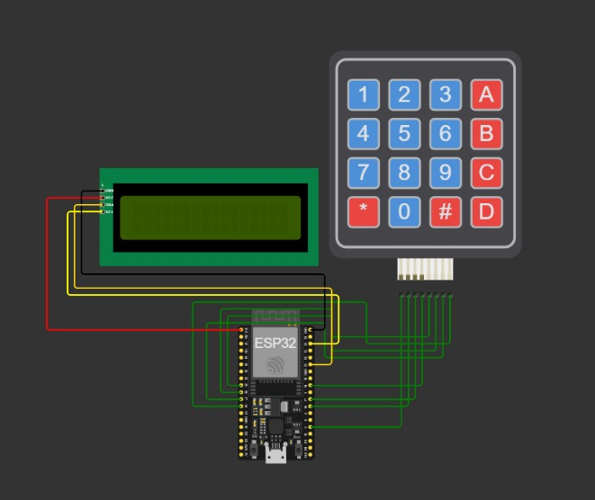
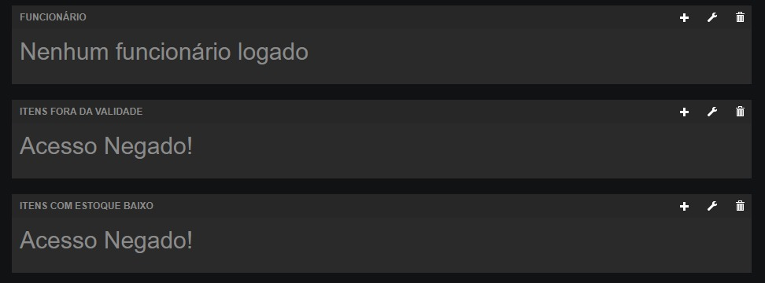
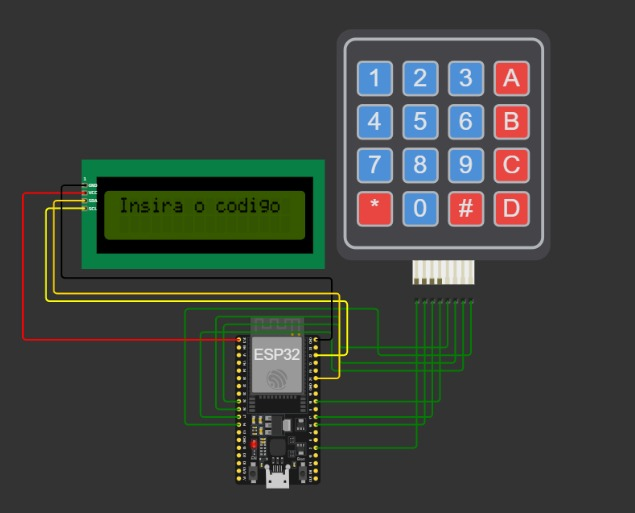
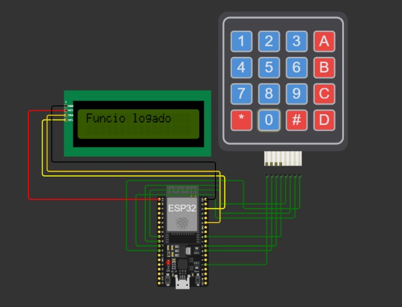
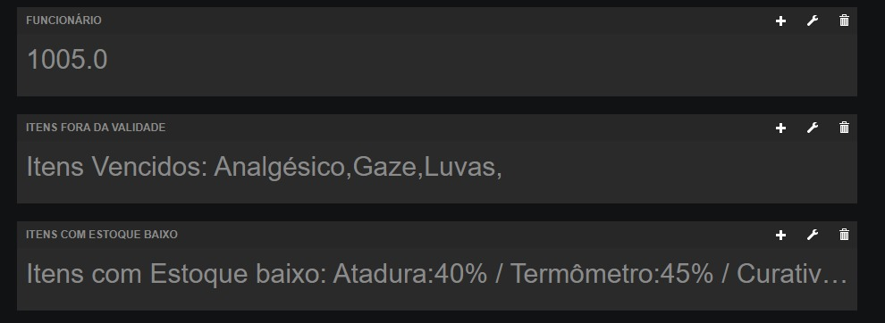

# 💙 VITA: Sistema Inteligente de Gestão de Estoque Hospitalar
O Projeto VITA busca implementar um sistema de gestão de estoque inteligente em hospitais, garantindo disponibilidade e prevenindo desperdícios. Com funcionalidades como controle em tempo real e rastreamento por código de barras, o projeto visa melhorar eficiência operacional, oferecer controle rigoroso e facilitar a integração na rotina dos profissionais de saúde.

### 🎯 Objetivos
- Assegurar que hospitais tenham acesso contínuo a materiais e medicamentos essenciais, evitando escassez.
- Evitar a expiração de medicamentos e materiais, reduzindo desperdícios e otimizando recursos financeiros.
- Melhorar a reposição de estoque, evitando a falta de itens essenciais e proporcionando rápido acesso aos profissionais de saúde.
- Manter um controle preciso sobre o estoque, reduzindo erros manuais e aprimorando a precisão dos registros.
- Integrar facilmente o sistema na rotina dos profissionais de saúde, utilizando a simplicidade do escaneamento de códigos de barras.

### 🩹 Dores que Busca Suprir
- Escassez de Materiais Essenciais.
- Desperdício de Recursos Financeiros.
- Ineficiência na Reposição de Estoque.
- Controle Fragilizado.
- Dificuldade de Rastreamento.
- Falta de Alertas Antecipados.
- Complexidade na Integração ao Fluxo de Trabalho.

## 🗃 Funcionalidades do Sistema

### 🔓 Autenticação de Funcionários via Keypad

O nosso sistema oferece uma forma eficiente e rapidá de autenticação para os funcionários através do keypad.

### 📊 Monitoramento de Níveis de Estoque

Após efetuar o login, os funcionários têm acesso à funcionalidade de verificação dos níveis de estoque. 
Essa ferramenta permite um acompanhamento em tempo real do status dos itens armazenados. 
Caso seja identificada uma quantidade baixa de algum produto, o sistema notifica automaticamente, proporcionando uma gestão proativa e evitando possíveis problemas de falta de estoque.

### 📆 Verificação da Validade dos Produtos

Além da verificação de nível de estoque, implementamos uma funcionalidade que verifica a validade dos produtos armazenados. 
Caso a validade de um item esteja próxima do vencimento ou tenha expirado, o sistema automaticamente notifica o administrador. 

### 🔒 Deslogar como Funcionário

A última funcionalidade oferecida é a opção de deslogar como funcionário. 
Isso proporciona segurança adicional, permitindo que os usuários encerrem sua sessão quando necessário, especialmente em ambientes compartilhados.

## 📋 Registro no postman

- Para realizar este projeto, foi usado do fiware descomplicado do Professor Cabrini,<a href="https://github.com/fabiocabrini/fiware">Clique aqui para ver</a>.
  
- Baixe o material e abra o Postman.
  
- Exporte os comandos disponíveis no material.
  
- Substitua a URL pelo endereço do broker.
  
- Vá para a seção "3. Provisioning a Smart Lamp" no material.
  
- No corpo (body) da requisição, substitua 'lamp' e 'lamp001' pelos nomes desejados para o registro.
  
- Insira os tópicos desejados, informando o nome e tipo (int, string, float, etc).
  
- Certifique-se de que o dispositivo foi registrado.
  
- Acesse a seção "5. List all Devices Provisioned" no material.

## 🌐 Tecnologias utilizadas
- WiFi:
**Biblioteca utilizada para facilitar a conexão e configuração da rede WiFi**
- PubSubClient:
**Biblioteca utilizada para implementação MQTT**
- LiquidCrystal_I2C:
**Biblioteca utilizada para usar o lcd_I2c**
- Keypad:
**Biblioteca utilizada para usar o keypad

## 📟 ESP32 e Wokwi Simulator
O ESP32 é um microcontrolador poderoso e versátil, amplamente utilizado para projetos de Internet das Coisas (IoT). 
Neste projeto, exploramos suas capacidades utilizando o simulador Wokwi, que oferece uma plataforma virtual para experimentação sem a necessidade de hardware físico. Isso proporciona um ambiente de desenvolvimento conveniente e eficiente.

- Link do do Wokwi <a href="https://wokwi.com/projects/382150998462319617">Clique aqui para ver</a>

## 🛰️ Servidor de IoT
A aplicação ESP32 no simulador Wokwi está conectada a um servidor de IoT, permitindo a troca de dados de forma eficiente. Isso possibilita o monitoramento remoto e a interação com o ESP32 por meio da internet.

## 🖥️ Freeboard Dashboard
Para visualizar e interagir com os dados provenientes do ESP32, implementamos o uso do Freeboard, uma plataforma de dashboard que facilita a criação de interfaces intuitivas e personalizáveis. O Freeboard permite a exibição em tempo real das informações coletadas pelo ESP32, oferecendo uma experiência de monitoramento simplificada.

- Link do Freeboard <a href="https://freeboard.io/board/pvoOVL">Clique aqui para ver</a>

## ✅ Iniciando a aplicação

- Antes da aplicação ser iniciada, é necessário abrir o Freeboard para receber as informações passadas pelo MQTT. <a href="https://freeboard.io/board/pvoOVL">Clique aqui para ver</a>

- Como o usuário não está logado, o acesso às dados é negado.

  
- Ao iniciar a aplicação, é mostrada a mensagem no lcd "Insira o codigo".
  

- Para logar como usuário, clique em qualquer tecla de 1 a 9.
- Para confirmar, clique 0.
- Funcionário Logado.

- Com o funcionário logado as funções de verificarValidade() e verificarEstoque() começam a funcionar em loop infinito.
  
- Função verificarValidade(): verifica as validades dos itens e da um MQTT.publish nos itens fora de validade.

- Função verificarEstoque(): verifica o nivel do estoque de cada item. Se o nivel for menor que 50, ele da um MQTT.publish nos itens que estão com estoque baixo e a porcentagem do nivel.

- No freeboard, é possivel ver: o codigo do funcionário logado e os dados que estão sendo publicados pelas funções verificarValidade() e verificarEstoque().

- Se o funcionário quiser deslogar, é somente necessário apertar a tecla 0 do keypad.

- Com o funcionário deslogado, o lcd vai voltar ao inicio da aplicação.

- e o freeboard vai mostrar acesso negado às informações, pois o funcionário não está logado

